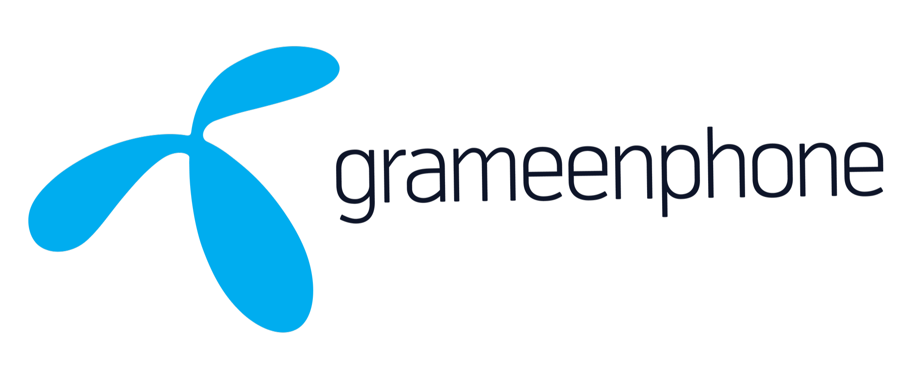
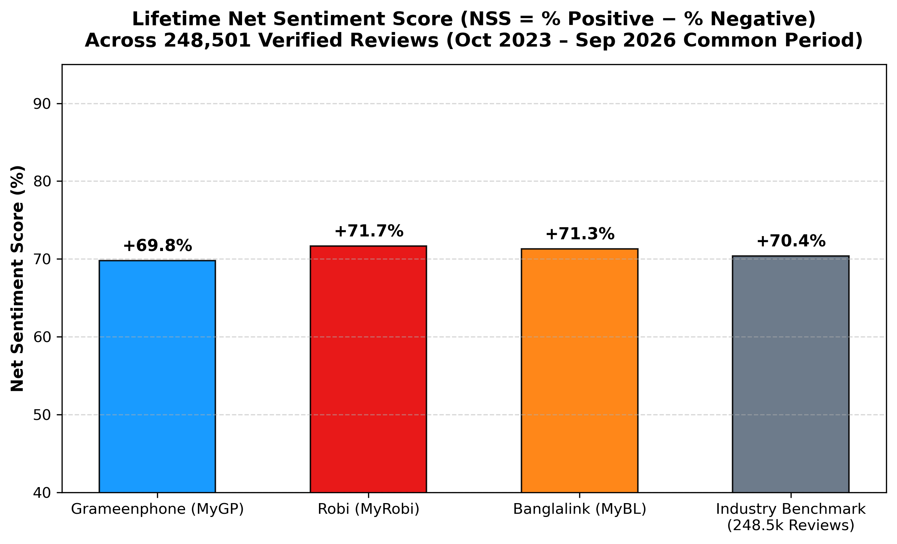
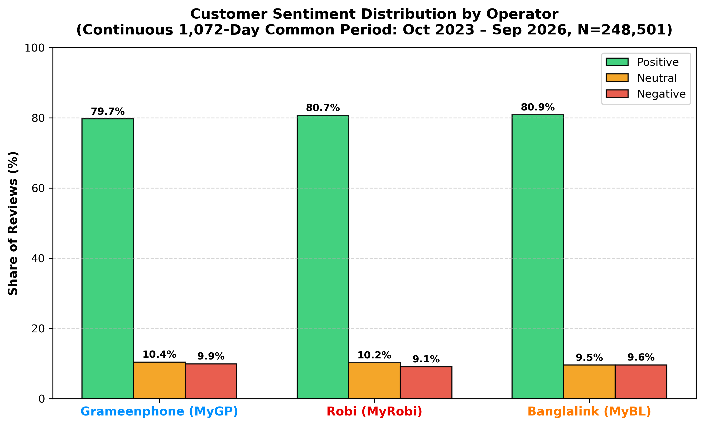
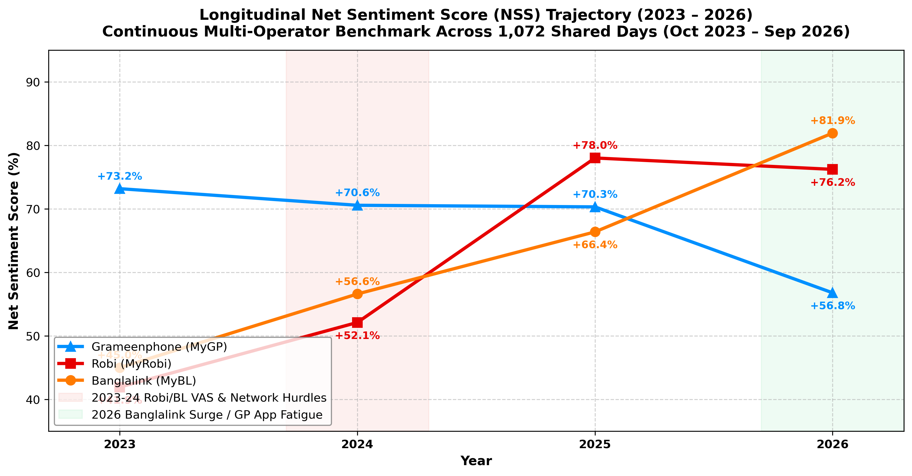
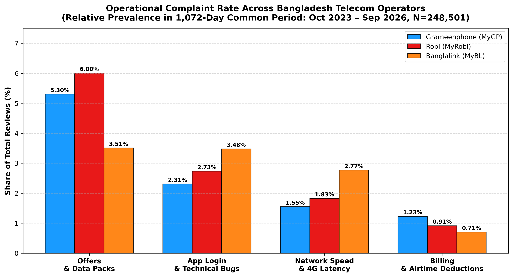
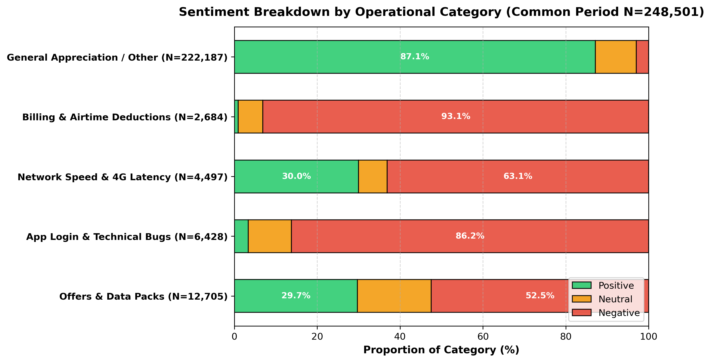

# 📡 Telecom Voice-of-Customer (VoC) Intelligence Engine
> **An enterprise end-to-end NLP & Business Intelligence pipeline for multilingual sentiment parsing, customer experience benchmarking, and operational strategy across Bangladesh's premier telecommunications operators.**

<div align="center">

|  |  |  |
| :---: | :---: | :---: |
| **Grameenphone Ltd.** | **Robi Axiata Limited** | **Banglalink Digital Communications Limited** |
| `com.portonics.mygp` | `net.omobio.robisc` | `com.arena.banglalinkmela.app` |
| **MyGP Platform** | **My Robi Platform** | **MyBL Platform** |

[](https://www.python.org/)
[](https://opensource.org/licenses/MIT)
[](scraped_data_global_2020_2026/classified/all_operators_common_duration_classified.csv)
[](scraped_data_global_2020_2026/classified/all_operators_classified_global_2020_2026.csv)
[](scraped_data_global_2020_2026/classified/)
[-brightgreen.svg)](ml/)

</div>

---

## 🎯 1. Executive Summary & Market Intelligence

This flagship project provides an empirical, end-to-end Voice-of-Customer (VoC) intelligence engine analyzing customer sentiment and operational complaints across Bangladesh's top three mobile network operators:
* **Grameenphone Ltd.** (operating the MyGP platform)
* **Robi Axiata Limited** (operating the MyRobi platform)
* **Banglalink Digital Communications Limited** (operating the MyBL platform)

*(Throughout this document, operators are subsequently referred to as **Grameenphone**, **Robi**, and **Banglalink**).*

> **Methodological Note on Common Duration Window**:  
> To guarantee strict statistical equity and eliminate temporal selection bias (ensuring no operator has missing historical windows in comparative analytics), all published benchmarks, comparative scorecards, trendlines, and category distributions strictly analyze the continuous **1,072-Day Common Duration Period** (**October 24, 2023 – September 30, 2026**, $N = 248,501$) where all three operators coexist simultaneously. The full multi-year corpus ($N = 398,193$, January 2020 – September 2026) is preserved in storage for extended longitudinal modeling.

### 📊 Common Duration Performance Scorecard ($N = 248,501$, October 24, 2023 – September 30, 2026)

Every review was scored by our production **Hero Soft-Voting Ensemble** (calibrated on 4,500 human-annotated multi-operator reviews, achieving **87.5% CV Accuracy** on Sentiment and **87.3%** on Operational Categories), cross-verified with **PyTorch BiLSTM + Attention**, **Balanced Logistic Regression**, and **Calibrated LinearSVC**.

```
+---------------------------------------------------------------------------------------------------------+
|                                COMMON DURATION VoC PERFORMANCE SCORECARD                                |
|                                (October 24, 2023 – September 30, 2026 | 1,072 Days)                      |
+----+----------------------+---------------+------------+-----------+------------+-----------------------+
| #  | Operator             | Total Reviews | Positive % | Neutral % | Negative % | Net Sentiment (NSS)   |
+----+----------------------+---------------+------------+-----------+------------+-----------------------+
| 1  | Grameenphone (MyGP)  | 161,491       | 79.7%      | 10.4%     | 9.9%       | +69.8% (Volume Scale) |
| 2  | Robi (MyRobi)        | 43,720        | 80.7%      | 10.2%     | 9.1%       | +71.7% (NSS Leader)   |
| 3  | Banglalink (MyBL)    | 43,290        | 80.9%      | 9.5%      | 9.6%       | +71.3% (Agile Growth) |
+----+----------------------+---------------+------------+-----------+------------+-----------------------+
| -- | Industry Benchmark   | 248,501       | 80.1%      | 10.2%     | 9.7%       | +70.4%                |
+----+----------------------+---------------+------------+-----------+------------+-----------------------+
```

> **Net Sentiment Score (NSS) Formula**:  
> $$\text{NSS} = \left(\frac{N_{\text{Positive}} - N_{\text{Negative}}}{N_{\text{Total}}}\right) \times 100$$  
> *Consistent operator analysis serial: **Grameenphone**, **Robi**, **Banglalink**.*

---

## 📊 2. Visual Analytics & Publication Intelligence Suite

All visualizations are generated natively in Python at publication-grade **300 DPI** using verified brand hex palettes: **Grameenphone (`#0090ff`)**, **Robi (`#e60000`)**, and **Banglalink (`#ff7a00`)**.

### A. Market Net Sentiment Score & Sentiment Breakdown
| Net Sentiment Score (NSS) Comparison | Sentiment Share by Operator |
| :---: | :---: |
|  |  |

### B. Longitudinal Trajectory Across Shared Horizon (2023 – 2026)
<div align="center">
  
</div>

### C. Operational Complaint Breakdown & Departmental Sentiment
| Actionable Complaint Rates by Operator | Sentiment Composition per Comment Type |
| :---: | :---: |
|  |  |

---

## 📈 3. Longitudinal Trajectory & Inflection Points (2023 – 2026)

Tracking customer sentiment across the shared 1,072-day window revealed clear shifts in market leadership and consumer satisfaction:

| Year | Grameenphone (MyGP) | Robi (MyRobi) | Banglalink (MyBL) | Historical Strategic Event |
| :---: | :---: | :---: | :---: | :--- |
| **2023** *(Q4)* | **+73.2%** (19,829) | **+41.9%** ⚠️ (1,888) | **+45.0%** (1,384) | **The 2023 Friction Point**: Robi and Banglalink faced acute onboarding and VAS balance deduction complaints in late 2023, while GP enjoyed strong baseline brand goodwill. |
| **2024** | **+70.6%** (75,057) | **+52.1%** (6,816) | **+56.6%** (9,897) | Grameenphone anchored massive review volume with steady 70%+ NSS; Robi and Banglalink rolled out UX stability improvements. |
| **2025** | **+70.3%** (54,258) | **+78.0%** 🚀 (16,115) | **+66.4%** (10,238) | **The 2025 Robi Turnaround**: Robi resolved core backend latency and modernized self-care, catapulting NSS to +78.0% (cutting negative reviews to just 6.0%). |
| **2026** | **+56.8%** 📉 (12,347) | **+76.2%** (18,901) | **+81.9%** 🏆 (21,771) | **The 2026 Market Reversal**: Banglalink surged to industry-leading **+81.9% NSS** (only 5.2% negative) on high self-care goodwill; Grameenphone dipped sharply to **+56.8% NSS** (17.4% negative) due to data pack pricing friction and OTP delays. |

---

## 🏷️ 4. Operational Category & Departmental Intelligence

Every review was classified into **5 operational domains** by our Soft-Voting Category Ensemble:

| Operational Category | Grameenphone (161.5k) | Robi (43.7k) | Banglalink (43.3k) | Operational Diagnosis |
| :--- | :---: | :---: | :---: | :--- |
| **Offers & Data Packs** | **5.30%** (8,561) | **6.00%** (2,625) | **3.51%** (1,519) | Robi and GP face significantly higher price sensitivity and data pack validity friction than Banglalink. |
| **App Login & Technical Bugs** | **2.31%** (3,727) | **2.73%** (1,195) | **3.48%** (1,506) | **Banglalink's Vulnerability**: Authentication/session stability and biometric login token timeouts. |
| **Network Speed & 4G Latency** | **1.55%** (2,500) | **1.83%** (798) | **2.77%** (1,199) | Grameenphone maintains the lowest network complaint rate, while Banglalink users report indoor 4G friction. |
| **Billing & Airtime Loss** | **1.23%** (1,979) | **0.91%** (399) | **0.71%** (306) | **Grameenphone's Primary Vulnerability**: Nearly double the accidental deduction complaints of Banglalink. |
| **General Appreciation / Other** | **89.62%** (144,724) | **88.52%** (38,703) | **89.54%** (38,760) | App praise, short reviews, emojis, and general service feedback. |

---

## 🏆 5. Empirical Multi-Paradigm Benchmark Matrix

Models were trained and evaluated on the curated ground truth ($N=4,500$ across Grameenphone, Robi, and Banglalink) using **5-Fold Stratified Cross-Validation**:

| Model Architecture | Task | CV Accuracy | Macro-F1 | Inference Throughput | Key Strengths / Characteristics |
| :--- | :---: | :---: | :---: | :---: | :--- |
| 🥇 **Hero Soft-Voting ML Ensemble** | **Operational Category** | **87.44%** | **0.7845** | **~18,200 rev/s** | **Overall Champion**: Sub-word character n-grams excel on Romanized Banglish (*"mb"*, *"kete niyeche"*, *"otp"*). |
| 🥇 **Hero Soft-Voting ML Ensemble** | **Sentiment Analysis** | **87.47%** | **0.7684** | **~17,500 rev/s** | Balanced voting between Logistic Regression, Calibrated LinearSVC, and ComplementNB. |
| 🚀 **Multilingual MiniLM Head** | **Operational Category** | **81.15%** | **0.7247** | ~2,100 rev/s | 384-dim multilingual dense embeddings; resilient to English/Bengali code-mixing. |
| 🚀 **Multilingual MiniLM Head** | **Sentiment Analysis** | **82.33%** | **0.7475** | ~2,100 rev/s | Cross-lingual sentence semantic capture. |
| 🧠 **Hybrid BiLSTM + Attention (GPU)**| **Operational Category** | **80.84%** | **0.7106** | Fast GPU Batched | Bidirectional context + Bahdanau attention on salient complaint tokens. |
| 🧠 **Hybrid BiLSTM + Attention (GPU)**| **Sentiment Analysis** | **81.50%** | **0.7180** | Fast GPU Batched | PyTorch neural architecture with inverse frequency class weighting. |
| 🇧🇩 **BUET BanglaBERT Head** | **Operational Category** | **74.88%** | **0.6253** | GPU Required | Native Bengali representations; sensitive to Romanized Banglish transliterations. |
| 📉 **Statistical Floor (Dummy)** | **Operational Category** | **60.68%** | **0.1511** | Instant | Naive majority-class guess without language understanding. |

---

## 💼 6. Operator Strategic Roadmaps

### 1. Grameenphone (MyGP) — *Scale Anchor*
* **Common Period NSS:** `+69.8%` | **2026 NSS:** `+56.8%` 📉
* **Core Vulnerabilities:** Billing deduction transparency (1.23%) and data pack pricing complaints (5.30%).
* **Strategic Lever:** Deploy dynamic micro-packs with rollover validity and a zero-click "Where Did My Balance Go?" transaction timeline.

### 2. Robi (MyRobi) — *Digital Lifestyle Leader*
* **Common Period NSS:** `+71.7%` | **2026 NSS:** `+76.2%` 🚀
* **Core Vulnerabilities:** Offers and data pack friction (6.00%) and app login bugs (2.73%).
* **Strategic Lever:** Overhaul biometric login token caching and simplify automated VAS cancellation toggles.

### 3. Banglalink (MyBL) — *Agile Value Champion*
* **Common Period NSS:** `+71.3%` | **2026 NSS:** `+81.9%` 🏆
* **Core Vulnerabilities:** Indoor/suburban 4G latency (2.77%) and technical login glitches (3.48%).
* **Strategic Lever:** Leverage high brand sentiment to transition promotional micro-rechargers into recurring monthly commitments while optimizing 4G edge caching.

---

## 📂 7. Repository Organization & File Structure

```text
telecom-Voice-of-Customer_intelligence/
├── assets/
│   ├── logos/                                # Official corporate logos (GP, Robi, BL)
│   └── plots/                                # Publication-grade 300 DPI visualizations
│       ├── net_sentiment_score_comparison_bars.png
│       ├── operator_sentiment_distribution_bars.png
│       ├── multi_year_sentiment_trend_line.png
│       ├── operator_category_complaint_distribution_bars.png
│       └── category_sentiment_stacked_bars.png
│
├── scraped_data_global_2020_2026/            # 🌟 MASTER DATASET SUITE (N=398,193)
│   ├── raw/                                  # 1. Scraped raw reviews (2020 - Sep 2026)
│   │   ├── mygp_global_2020_to_sep2026.csv   # 161,491 unique reviews
│   │   ├── myrobi_global_2020_to_sep2026.csv # 155,661 unique reviews
│   │   └── mybl_global_2020_to_sep2026.csv   # 81,040 unique reviews
│   │
│   ├── classified/                           # 2. Classified Datasets & Common Benchmark
│   │   ├── all_operators_common_duration_classified.csv # 🏆 Active Benchmark (N=248,501 | 1,072 Days)
│   │   ├── all_operators_classified_global_2020_2026.csv# Master Multi-Year Corpus (N=398,193)
│   │   ├── common_duration_summary.json      # Statistical metadata for shared 1,072-day window
│   │   ├── mygp_classified_global_2020_2026.csv
│   │   ├── myrobi_classified_global_2020_2026.csv
│   │   ├── mybl_classified_global_2020_2026.csv
│   │   ├── global_multi_year_intelligence_report.md
│   │   ├── global_voc_intelligence_report.json
│   │   └── yearly_intelligence_trends.json
│   │
│   └── pipeline/                             # 3. High-Throughput Production Scripts
│       ├── run_parallel_scrapers.py
│       ├── merge_and_sync_all_datasets.py    # Strict deduplication & common window extraction
│       ├── classify_global_dataset.py        # Batch classifies reviews (~1,000 rev/s)
│       └── generate_global_visualizations.py # Renders 300 DPI publication plots
│
├── ml/                                       # Classical Machine Learning Engine
│   ├── models/
│   │   ├── sentiment_voting_classifier.joblib # 🏆 Production Hero Model (Sentiment, 87.5% CV)
│   │   ├── category_voting_classifier.joblib  # 🏷️ Production Category Hero Model (87.4% CV)
│   │   ├── primary_logistic_regression.joblib
│   │   └── challenger_linearsvc.joblib
│   └── predict.py                            # CLI dual prediction utility
│
├── dl/                                       # Deep Learning & Neural Models (Colab GPU Suites)
│   ├── telecom_voc_master_unified_colab.ipynb # 🏆 Master Unified Colab: ALL ML + DL Models
│   ├── models/
│   │   ├── bilstm_sentiment_model.pt         # Hybrid BiLSTM + Attention (Sentiment)
│   │   ├── bilstm_category_model.pt          # Hybrid BiLSTM + Attention (Category)
│   │   ├── bilstm_vocab.joblib               # Model vocabulary dictionary
│   │   └── minilm_sent_head.joblib           # Multilingual MiniLM Head
│   └── README.md                             # Deep learning documentation
│
├── archive/                                  # 🗄️ ARCHIVED DATASETS & PROBES
│   └── scraped_data_2020/                    # Historical 402-day common window (N=83,417)
│       ├── common_duration/                  # Archived 83.4k common duration cohort
│       ├── gold_set/                         # Human Gold Standard benchmark (N=600)
│       └── ios_probe/                        # Apple App Store empirical probe (N=1,199)
│
├── requirements.txt                          # Top-level dependencies
└── README.md                                 # Master Repository Documentation
```

---

## ⚡ 8. Quickstart & Execution Guide

### 1. Initialize Python Environment
```bash
git clone https://github.com/rh61632/telecom-Voice-of-Customer_intelligence.git
cd telecom-Voice-of-Customer_intelligence

source ml/.venv/bin/activate
pip install -r requirements.txt
```

### 2. Extract Deduplicated Common Duration Window
```bash
python scraped_data_global_2020_2026/pipeline/merge_and_sync_all_datasets.py
```

### 3. Render 300 DPI Visualizations
```bash
python scraped_data_global_2020_2026/pipeline/generate_global_visualizations.py
```

---

## 📜 Citation & License

This project is licensed under the MIT License. If you use this methodology, multi-year dataset, or dual-gram code-switched Banglish feature extraction in your research:

```bibtex
@misc{telecom_voc_intelligence_2026,
  author = {Ratul Hasan},
  title = {Cross-Operator Voice of Customer (VoC) Intelligence Engine for Bangladesh Telecom Platforms},
  year = {2026},
  publisher = {GitHub},
  howpublished = {\url{https://github.com/rh61632/telecom-Voice-of-Customer_intelligence}}
}
```

---

## 🙏 Acknowledgments

* **AI-Assisted Engineering:** Data pipeline automation, terminal interactive annotation tooling, and visualization suites were developed in collaborative pair-programming with **Google Antigravity** (Google DeepMind), adhering to COPE and ACM AI transparency guidelines.
* **LLM Weak Supervision:** Gratitude to **Groq** for high-throughput cloud inference (`qwen/qwen3.8-27b`) enabling initial zero-shot seed dataset translation and taxonomy labeling.
* **Open-Source Community:** Built upon foundational open-source packages including `scikit-learn`, `PyTorch`, `sentence-transformers`, `pandas`, `numpy`, `matplotlib`, and `google-play-scraper`.
