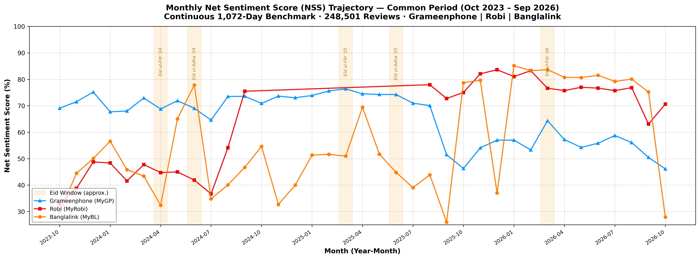

# 📡 Telecom Voice-of-Customer (VoC) Intelligence Engine
> **An enterprise end-to-end NLP & Business Intelligence pipeline for multilingual sentiment parsing, customer experience benchmarking, and operational strategy across Bangladesh's premier telecommunications operators.**

<div align="center">

|  |  |  |
| :---: | :---: | :---: |
| **Grameenphone Ltd.** | **Robi Axiata Limited** | **Banglalink Digital Communications Limited** |
| `com.portonics.mygp` | `net.omobio.robisc` | `com.arena.banglalinkmela.app` |
| **MyGP Platform** | **My Robi Platform** | **MyBL Platform** |

[](https://www.python.org/)
[](https://opensource.org/licenses/MIT)
[](scraped_data_global_2020_2026/raw/)
[](scraped_data_global_2020_2026/classified/common_duration_summary.json)
[](scraped_data_global_2020_2026/classified/)
[](scraped_data_global_2020_2026/classified/common_duration_summary.json)
[-success.svg)](dl/)
[-brightgreen.svg)](ml/)
[](TODO.txt)
</div>

---

## 🎯 1. Executive Summary & Market Intelligence

This flagship project provides an empirical, end-to-end Voice-of-Customer (VoC) intelligence engine analyzing customer sentiment and operational complaints across Bangladesh's top three mobile network operators:
* **Grameenphone Ltd.** (operating the MyGP platform)
* **Robi Axiata Limited** (operating the MyRobi platform)
* **Banglalink Digital Communications Limited** (operating the MyBL platform)

*(Throughout this document, operators are subsequently referred to as **Grameenphone**, **Robi**, and **Banglalink**).*

> **Methodological Note on Common Duration Window**:  
> To guarantee strict statistical equity and eliminate temporal selection bias (ensuring no operator has missing historical windows in comparative analytics), all published benchmarks, comparative scorecards, trendlines, and category distributions strictly analyze the continuous **1,078-Day Common Duration Period** (**October 24, 2023 – October 6, 2026**, $N = 249,268$) where all three operators coexist simultaneously. The full multi-year corpus ($N = 398,958$, January 2020 – October 2026) is preserved in storage for extended longitudinal modeling.

### 📊 Common Duration Performance Scorecard ($N = 249,268$, October 24, 2023 – October 6, 2026)

Every review was scored by our production **Hero Soft-Voting Ensemble** (calibrated on 4,500 human-annotated multi-operator reviews, achieving **87.5% CV Accuracy** on Sentiment and **87.3%** on Operational Categories), cross-verified with **PyTorch BiLSTM + Attention**, **Balanced Logistic Regression**, **Calibrated LinearSVC**, and SOTA **BUET BanglaBERT** (**91.6% CV Accuracy**).

```
+---------------------------------------------------------------------------------------------------------+
|                                COMMON DURATION VoC PERFORMANCE SCORECARD                                |
|                                (October 24, 2023 – October 6, 2026 | 1,078 Days)                        |
+----+----------------------+---------------+------------+-----------+------------+-----------------------+
| #  | Operator             | Total Reviews | Positive % | Neutral % | Negative % | Net Sentiment (NSS)   |
+----+----------------------+---------------+------------+-----------+------------+-----------------------+
| 1  | Grameenphone (MyGP)  | 161,737       | 79.7%      | 10.4%     | 9.9%       | +69.7% (Volume Scale) |
| 2  | Robi (MyRobi)        | 44,193        | 80.7%      | 10.3%     | 9.0%       | +71.6% (NSS Leader)   |
| 3  | Banglalink (MyBL)    | 43,338        | 80.8%      | 9.6%      | 9.6%       | +71.2% (Agile Growth) |
+----+----------------------+---------------+------------+-----------+------------+-----------------------+
| -- | Industry Benchmark   | 249,268       | 80.1%      | 10.2%     | 9.7%       | +70.3%                |
+----+----------------------+---------------+------------+-----------+------------+-----------------------+
```

> **Net Sentiment Score (NSS) Formula**:  
> $$\text{NSS} = \left(\frac{N_{\text{Positive}} - N_{\text{Negative}}}{N_{\text{Total}}}\right) \times 100$$  
> *Consistent operator analysis serial: **Grameenphone**, **Robi**, **Banglalink**.*

---

## 📊 2. Visual Analytics & Publication Intelligence Suite

All visualizations are generated natively in Python at publication-grade **300 DPI** using verified brand hex palettes: **Grameenphone (`#0090ff`)**, **Robi (`#e60000`)**, and **Banglalink (`#ff7a00`)**.

### A. Market Net Sentiment Score & Sentiment Breakdown
| Net Sentiment Score (NSS) Comparison | Sentiment Share by Operator |
| :---: | :---: |
|  |  |

### B. Longitudinal Trajectory Across Shared Horizon (2023 – 2026)
<div align="center">
  
</div>

### C. Operational Complaint Breakdown & Departmental Sentiment
| Actionable Complaint Rates by Operator | Sentiment Composition per Comment Type |
| :---: | :---: |
|  |  |

### D. Monthly-Granularity Sentiment Dynamics & Seasonality (Oct 2023 – Oct 2026)
<div align="center">
  
</div>

---

## 📈 3. Longitudinal Trajectory & Inflection Points (2023 – 2026)

Tracking customer sentiment across the shared 1,078-day window revealed clear shifts in market leadership and consumer satisfaction:

| Year | Grameenphone (MyGP) | Robi (MyRobi) | Banglalink (MyBL) | Historical Strategic Event |
| :---: | :---: | :---: | :---: | :--- |
| **2023** *(Q4)* | **+73.2%** (19,829) | **+41.9%** ⚠️ (1,888) | **+45.0%** (1,384) | **The 2023 Friction Point**: Robi and Banglalink faced acute onboarding and VAS balance deduction complaints in late 2023, while GP enjoyed strong baseline brand goodwill. |
| **2024** | **+70.6%** (75,057) | **+52.1%** (6,816) | **+56.6%** (9,897) | Grameenphone anchored massive review volume with steady 70%+ NSS; Robi and Banglalink rolled out UX stability improvements. |
| **2025** | **+70.3%** (54,258) | **+78.0%** 🚀 (16,115) | **+66.4%** (10,238) | **The 2025 Robi Turnaround**: Robi resolved core backend latency and modernized self-care, catapulting NSS to +78.0% (cutting negative reviews to just 6.0%). |
| **2026** | **+56.6%** 📉 (12,593) | **+76.1%** (19,374) | **+81.8%** 🏆 (21,819) | **The 2026 Market Reversal**: Banglalink surged to industry-leading **+81.8% NSS** (only 5.3% negative) on high self-care goodwill; Grameenphone dipped sharply to **+56.6% NSS** (17.5% negative) due to data pack pricing friction and OTP delays. |


---

## 🏷️ 4. Operational Category & Departmental Intelligence

Every review was classified into **5 operational domains** by our Soft-Voting Category Ensemble:

| Operational Category | Grameenphone (161.7k) | Robi (44.2k) | Banglalink (43.3k) | Operational Diagnosis |
| :--- | :---: | :---: | :---: | :--- |
| **Offers & Data Packs** | **5.31%** (8,583) | **6.00%** (2,653) | **3.52%** (1,524) | Robi and GP face significantly higher price sensitivity and data pack validity friction than Banglalink. |
| **App Login & Technical Bugs** | **2.31%** (3,733) | **2.73%** (1,207) | **3.48%** (1,509) | **Banglalink's Vulnerability**: Authentication/session stability and biometric login token timeouts. |
| **Network Speed & 4G Latency** | **1.55%** (2,509) | **1.82%** (805) | **2.78%** (1,204) | Grameenphone maintains the lowest network complaint rate, while Banglalink users report indoor 4G friction. |
| **Billing & Airtime Loss** | **1.23%** (1,986) | **0.92%** (406) | **0.71%** (306) | **Grameenphone's Primary Vulnerability**: Nearly double the accidental deduction complaints of Banglalink. |
| **General Appreciation / Other** | **89.61%** (144,926) | **88.53%** (39,122) | **89.52%** (38,795) | App praise, short reviews, emojis, and general service feedback. |

---

## 🏆 5. Empirical Multi-Paradigm Benchmark Matrix

Models were trained and evaluated on the curated ground truth ($N=4,500$ across Grameenphone, Robi, and Banglalink) using **5-Fold Stratified Cross-Validation**:

| Model Architecture | Task | CV Accuracy | Macro-F1 | Inference Throughput | Key Strengths / Characteristics |
| :--- | :---: | :---: | :---: | :---: | :--- |
| 🥇 **BUET BanglaBERT (Fine-Tuned)** | **Sentiment Analysis** | **91.60%** | **0.8598** | GPU Batched | **Overall Sentiment SOTA**: End-to-end transformer fine-tuning (+4.1% Acc, +9.1% F1 over Ensemble). |
| 🥇 **Hero Soft-Voting ML Ensemble** | **Operational Category** | **87.44%** | **0.7845** | **~18,200 rev/s** | **Category Champion**: Sub-word character n-grams excel on Romanized Banglish (*"mb"*, *"kete niyeche"*, *"otp"*). |
| 🥈 **Hero Soft-Voting ML Ensemble** | **Sentiment Analysis** | **87.47%** | **0.7684** | **~17,500 rev/s** | High-throughput CPU production engine (LR + Calibrated LinearSVC + ComplementNB). |
| 🥈 **BUET BanglaBERT (Fine-Tuned)** | **Operational Category** | **85.27%** | **0.7624** | GPU Batched | Contextual transformer representations; massive leap from 74.88% frozen baseline (+10.4% Acc). |
| 🚀 **Multilingual MiniLM Head** | **Sentiment Analysis** | **82.33%** | **0.7475** | ~2,100 rev/s | 384-dim multilingual dense embeddings; cross-lingual semantic transfer. |
| 🚀 **Multilingual MiniLM Head** | **Operational Category** | **81.15%** | **0.7247** | ~2,100 rev/s | Multilingual sentence semantic representations. |
| 🧠 **Hybrid BiLSTM + Attention (GPU)**| **Sentiment Analysis** | **81.50%** | **0.7180** | Fast GPU Batched | PyTorch bidirectional recurrent architecture with Bahdanau attention. |
| 🧠 **Hybrid BiLSTM + Attention (GPU)**| **Operational Category** | **80.84%** | **0.7106** | Fast GPU Batched | Sequential token context + inverse frequency class weighting. |
| 📉 **BUET BanglaBERT (Frozen Head)**| **Operational Category** | **74.88%** | **0.6253** | GPU Required | Baseline frozen feature extractor without end-to-end gradient updates. |
| 📉 **Statistical Floor (Dummy)** | **Operational Category** | **60.68%** | **0.1511** | Instant | Naive majority-class guess without language understanding. |

---

## 💼 6. Operator Strategic Roadmaps

### 1. Grameenphone (MyGP) — *Scale Anchor*
* **Common Period NSS:** `+69.7%` | **2026 NSS:** `+56.6%` 📉
* **Core Vulnerabilities:** Billing deduction transparency (1.23%) and data pack pricing complaints (5.31%).
* **Strategic Lever:** Deploy dynamic micro-packs with rollover validity and a zero-click "Where Did My Balance Go?" transaction timeline.

### 2. Robi (MyRobi) — *Digital Lifestyle Leader*
* **Common Period NSS:** `+71.6%` | **2026 NSS:** `+76.1%` 🚀
* **Core Vulnerabilities:** Offers and data pack friction (6.00%) and app login bugs (2.73%).
* **Strategic Lever:** Overhaul biometric login token caching and simplify automated VAS cancellation toggles.

### 3. Banglalink (MyBL) — *Agile Value Champion*
* **Common Period NSS:** `+71.2%` | **2026 NSS:** `+81.8%` 🏆
* **Core Vulnerabilities:** Indoor/suburban 4G latency (2.78%) and technical login glitches (3.48%).
* **Strategic Lever:** Leverage high brand sentiment to transition promotional micro-rechargers into recurring monthly commitments while optimizing 4G edge caching.

---

## 📂 7. Repository Organization & File Structure

```text
telecom-Voice-of-Customer_intelligence/
├── assets/
│   ├── logos/                                # Official corporate logos (GP, Robi, BL)
│   └── plots/                                # Publication-grade 300 DPI visualizations
│       ├── net_sentiment_score_comparison_bars.png
│       ├── operator_sentiment_distribution_bars.png
│       ├── monthly_sentiment_trend_line.png
│       ├── multi_year_sentiment_trend_line.png
│       ├── operator_category_complaint_distribution_bars.png
│       ├── category_sentiment_stacked_bars.png
│       └── monthly_nss_trend_line.png        # 📈 Monthly-granularity trajectory (48 pts)
│
├── data/                                     # Curated Ground-Truth Training Dataset
│   └── processed/                            # 4,500 Multi-Operator Labeled Reviews (GP, Robi, BL)
│       ├── mygp_classified_reviews.csv
│       ├── myrobi_classified_reviews.csv
│       └── mybl_classified_reviews.csv
│
├── scraped_data_global_2020_2026/            # 🌟 MASTER DATASET SUITE (N=398,958)
│   ├── raw/                                  # 1. Scraped raw reviews (2020 - Oct 2026)
│   │   ├── mygp_global_2020_to_sep2026.csv   # 161,738 unique reviews
│   │   ├── myrobi_global_2020_to_sep2026.csv # 156,137 unique reviews
│   │   └── mybl_global_2020_to_sep2026.csv   # 81,083 unique reviews
│   │
│   ├── classified/                           # 2. Classified Datasets & Common Benchmark
│   │   ├── all_operators_common_duration_classified.csv # 🏆 Active Benchmark (N=249,268 | 1,078 Days)*
│   │   ├── all_operators_classified_global_2020_2026.csv# Master Multi-Year Corpus (N=398,958)*
│   │   ├── common_duration_summary.json      # Statistical metadata for shared 1,078-day window
│   │   ├── mygp_classified_global_2020_2026.csv   # 161,738 classified reviews (GP)
│   │   ├── myrobi_classified_global_2020_2026.csv # 156,137 classified reviews (Robi)
│   │   ├── mybl_classified_global_2020_2026.csv   # 81,083 classified reviews (BL)
│   │   ├── global_multi_year_intelligence_report.md
│   │   ├── global_voc_intelligence_report.json
│   │   └── yearly_intelligence_trends.json
│   │
│   └── pipeline/                             # 3. High-Throughput Production Scripts
│       ├── run_parallel_scrapers.py          # Parallel scrapers (supports --incremental)
│       ├── scraper_worker.py                 # Multi-operator worker script
│       ├── merge_and_sync_all_datasets.py    # Strict deduplication & common window extraction
│       ├── classify_global_dataset.py        # Batch classifies reviews (~1,000 rev/s)
│       └── generate_global_visualizations.py # Renders 300 DPI publication plots (6 plots)
│
├── ml/                                       # Classical Machine Learning Engine
│   ├── models/
│   │   ├── sentiment_voting_classifier.joblib # 🏆 Production Hero Model (Sentiment, 87.5% CV)
│   │   ├── category_voting_classifier.joblib  # 🏷️ Production Category Hero Model (87.4% CV)
│   │   ├── primary_logistic_regression.joblib
│   │   └── challenger_linearsvc.joblib
│   └── predict.py                            # CLI dual prediction utility
│
├── dl/                                       # Deep Learning & Neural Models (Colab GPU Suites)
│   ├── telecom_voc_banglabert_finetuning_colab.ipynb # 🇧🇩 BUET BanglaBERT Fine-Tuning Suite (91.6% Acc)
│   ├── telecom_voc_master_unified_colab.ipynb # 🏆 Master Unified Colab: ALL ML + DL Models
│   ├── finetune_banglabert.py                # Standalone end-to-end BanglaBERT fine-tuning CLI
│   ├── models/
│   │   ├── banglabert_finetuned_sentiment/   # 🥇 SOTA Sentiment Model (91.60% CV Acc)
│   │   ├── banglabert_finetuned_category/    # 🥈 Category Model (85.27% CV Acc)
│   │   ├── bilstm_sentiment_model.pt         # Hybrid BiLSTM + Attention (Sentiment)
│   │   ├── bilstm_category_model.pt          # Hybrid BiLSTM + Attention (Category)
│   │   ├── bilstm_vocab.joblib               # Model vocabulary dictionary
│   │   └── minilm_sent_head.joblib           # Multilingual MiniLM Head
│   ├── reports/
│   │   └── banglabert_finetuning_report.txt  # Detailed classification metrics
│   └── README.md                             # Deep learning documentation
│
├── archive/                                  # 🗄️ ARCHIVED DATASETS & PROBES
│   ├── seed_pipeline_groq/                   # Phase 1 Groq LLM seed pipeline & datasets
│   └── scraped_data_2020/                    # Historical 402-day common window (N=83,417)
│       ├── common_duration/                  # Archived 83.4k common duration cohort
│       ├── gold_set/                         # Human Gold Standard benchmark (N=600)
│       └── ios_probe/                        # Apple App Store empirical probe (N=1,199)
│
├── TODO.txt                                  # 📋 Future Roadmap & Deferred Tasks (HF Hub, Demo, Calibration)
├── requirements.txt                          # Top-level unified dependencies
└── README.md                                 # Master Repository Documentation
```

> *\* Note: Due to GitHub file-size limits, the consolidated datasets (`all_operators_classified_global_2020_2026.csv` [103 MB] and `all_operators_common_duration_classified.csv` [65 MB]) are omitted from Git. They are automatically reconstructed in 2 seconds from the 3 tracked operator CSVs by running `merge_and_sync_all_datasets.py`.*

---

## ⚡ 8. Quickstart & Execution Guide

### 1. Initialize Python Environment
```bash
git clone https://github.com/rh61632/telecom-Voice-of-Customer_intelligence.git
cd telecom-Voice-of-Customer_intelligence

source ml/.venv/bin/activate
pip install -r requirements.txt
```

### 2. Refresh Data (Incremental — only fetches reviews newer than last scrape)
```bash
# Full re-scrape from scratch (first-time or reset):
python scraped_data_global_2020_2026/pipeline/run_parallel_scrapers.py

# Incremental update (appends only new reviews since last run — fast):
python scraped_data_global_2020_2026/pipeline/run_parallel_scrapers.py --incremental
```

### 3. Merge, Deduplicate & Re-Classify New Reviews
```bash
python scraped_data_global_2020_2026/pipeline/merge_and_sync_all_datasets.py
```

### 4. Render 300 DPI Visualizations
```bash
python scraped_data_global_2020_2026/pipeline/generate_global_visualizations.py
```

### 5. Real-Time CLI Inference
```bash
# High-throughput production dual inference (CPU, ~18,000 rev/s):
python ml/predict.py --text "নেটওয়ার্ক খুব বাজে কিন্তু অফার ভালো"
```

### 6. Interactive Google Colab Notebooks (GPU Training & SOTA Replication)
For GPU training without local hardware:
* **[BUET BanglaBERT SOTA Suite](dl/telecom_voc_banglabert_finetuning_colab.ipynb)**: End-to-end transformer fine-tuning achieving **91.60% Sentiment Accuracy**.
* **[Master Unified Suite](dl/telecom_voc_master_unified_colab.ipynb)**: Benchmarks all 8 ML/DL architectures in a single unified workflow.

---

## 🗺️ 9. Future Roadmap & Development Milestones

For active tracking of deferred milestones, model checkpoint hosting on Hugging Face Model Hub, multi-annotator agreement protocols (Cohen's Kappa), and interactive Streamlit web demos, see **[TODO.txt](TODO.txt)**.

---

## 📜 Citation & License

This project is licensed under the MIT License. If you use this methodology, multi-year dataset, or dual-gram code-switched Banglish feature extraction in your research:

```bibtex
@misc{telecom_voc_intelligence_2026,
  author = {Ratul Hasan},
  title = {Cross-Operator Voice of Customer (VoC) Intelligence Engine for Bangladesh Telecom Platforms},
  year = {2026},
  publisher = {GitHub},
  howpublished = {\url{https://github.com/rh61632/telecom-Voice-of-Customer_intelligence}}
}
```

---

## 🙏 Acknowledgments

* **AI-Assisted Engineering:** Data pipeline automation, terminal interactive annotation tooling, and visualization suites were developed in collaborative pair-programming with **Google Antigravity** (Google DeepMind), adhering to COPE and ACM AI transparency guidelines.
* **LLM Weak Supervision:** Gratitude to **Groq** for high-throughput cloud inference (`qwen/qwen3.8-27b`) enabling initial zero-shot seed dataset translation and taxonomy labeling.
* **Open-Source Community:** Built upon foundational open-source packages including `scikit-learn`, `PyTorch`, `sentence-transformers`, `pandas`, `numpy`, `matplotlib`, and `google-play-scraper`.
