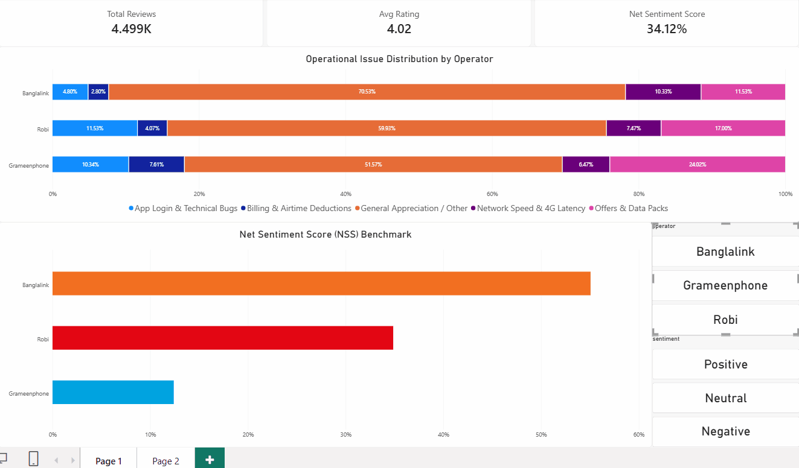
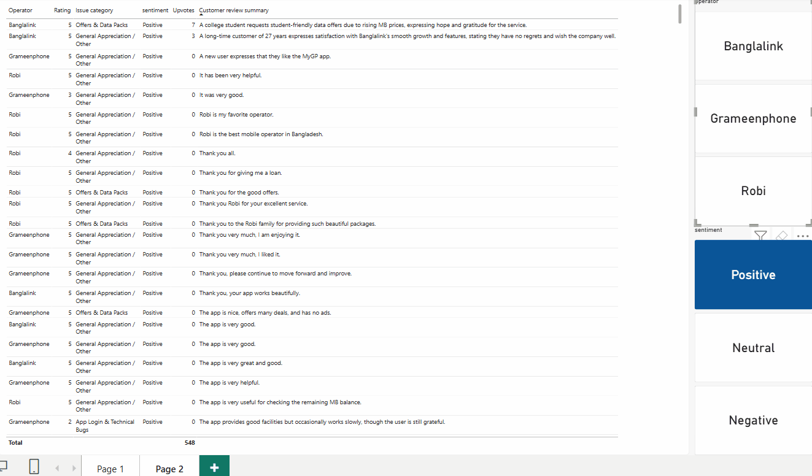

# 📡 Cross-Operator Voice of Customer (VoC) Intelligence Engine
> **An enterprise analytics pipeline for multilingual sentiment parsing, customer experience benchmarking, and operational insight extraction across Bangladesh's premier telecommunications platforms.**

<div align="center">

|  |  |  |
| :---: | :---: | :---: |
| **Grameenphone** | **Banglalink** | **Robi Axiata** |
| `com.portonics.mygp` | `com.arena.banglalinkmela.app` | `net.omobio.robisc` |
| **MyGP Platform** | **MyBL Platform** | **My Robi Platform** |

</div>

---

## 🎯 Executive Overview & Demos

This business intelligence solution ingests customer feedback from the Google Play Store, processes multilingual expressions (Bangla, English, and Banglish) through an LLM semantic pipeline, and surfaces strategic product insights in an interactive Power BI dashboard.

### 1. Market Experience & Strategic Overview (Page 1)


* **Cross-Operator Sentiment Benchmarking:** Evaluates comparative customer satisfaction metrics to measure digital product adoption and user goodwill across operators in Bangladesh.
* **Operational Feedback Distribution:** Normalizes category feedback across apps to highlight areas of user appreciation and opportunities for product optimization.
* **Core Experience Pillars:** Categorizes customer commentary into core functional areas—Network Performance, App Usability, Billing Inquiries, and Package Preferences—enabling product teams to identify customer priorities.

---

### 2. Voice-of-Customer Granular Inspector (Page 2)


* **Multilingual Context Normalization:** Translates regional terminology and feedback into standardized English summaries to help cross-functional stakeholders understand user needs.
* **Engagement-Driven Prioritization:** Ranks customer reviews by upvotes (`thumbs_up`) to spotlight key functional improvements and feature requests from the community.

---

## 🏗️ Technical Architecture & Data Lineage

```text
[Google Play Store API]
          │
          ▼  (Batch Scraper / Python)
[data/raw/*.csv] (~4,500 localized raw reviews: 1,500 per operator)
          │
          ▼  (LLM Semantic Extraction & Translation Pipeline)
  ├── Multilingual Translation (Bangla / Banglish -> Standardized English)
  ├── Functional Categorization (Network, Packs & Offers, Account, App Performance)
  └── Sentiment Classification (Positive, Neutral, Negative)
          │
          ▼  (Schema Validation & Data Cleansing)
[data/processed/fact_reviews.csv]
          │
          ▼  (Power Query Star Schema / Relational Model)
[Power BI Desktop Engine]
  ├── Relational Modeling (fact_reviews ↔ dim_sentiment)
  └── Custom DAX KPI Calculations
```

---

## 📐 Core Metric Definitions

| Metric | Business Definition | DAX Expression |
| :--- | :--- | :--- |
| **Net Sentiment Score (NSS)** | Normalized sentiment index: $\frac{\text{Positive} - \text{Negative}}{\text{Total Classified}}$ | `DIVIDE(CALCULATE(COUNTROWS(fact_reviews), fact_reviews[sentiment] = "Positive") - CALCULATE(COUNTROWS(fact_reviews), fact_reviews[sentiment] = "Negative"), CALCULATE(COUNTROWS(fact_reviews), fact_reviews[sentiment] IN {"Positive", "Neutral", "Negative"}), 0)` |
| **Average Rating** | Arithmetic mean of user review scores (1–5 scale) | `ROUND(AVERAGE(fact_reviews[rating]), 2)` |
| **Review Volume** | Total processed and structured customer feedback records | `COUNTROWS(fact_reviews)` |

---

## 📂 Repository File Structure

```text
├── assets/
│   ├── page1_demo.gif             # Interactive recording of Executive Benchmark
│   ├── page2_demo.gif             # Interactive recording of VoC Inspector
│   └── logos/
│       ├── banglalink.png         # Banglalink brand asset
│       ├── gp.png                 # Grameenphone brand asset
│       └── robi.png               # Robi Axiata brand asset
├── data/
│   ├── processed/                 # LLM-classified and structured datasets
│   └── raw/                       # Extracted review datasets (1,500 per operator)
├── src/
│   ├── scraper.py                 # Play Store data collection engine
│   └── classifier.py              # LLM inference, translation, and taxonomy pipeline
├── Voice_of_Customer.pbix         # Power BI analytical report
├── requirements.txt               # Python package dependencies
├── .gitignore                     # Repository exclusions
└── README.md
```

---

## ⚙️ Local Setup & Reproduction

### 1. Clone & Initialize Environment
```bash
git clone https://github.com/rh61632/telecom-Voice-of-Customer_intelligence.git
cd telecom-Voice-of-Customer_intelligence

# Create virtual environment
python -m venv venv

# Activate virtual environment
# Windows (PowerShell):
.\venv\Scripts\Activate.ps1
# Linux / macOS:
source venv/bin/activate

# Install dependencies
pip install -r requirements.txt
```

### 2. Configure Environment Variables
Create a `.env` file in the root directory:
```env
GROQ_API_KEY="your_api_key_here"
```

### 3. Run Ingestion & Classification Pipeline
```bash
# Extract reviews from Google Play Store (1,500 reviews per operator)
python src/scraper.py

# Run multilingual translation and zero-shot taxonomy labeling
python src/classifier.py
```

### 4. Load Visualizations
Open `Voice_of_Customer.pbix` inside **Power BI Desktop** and click **Refresh** on the Home tab to update the data model.
