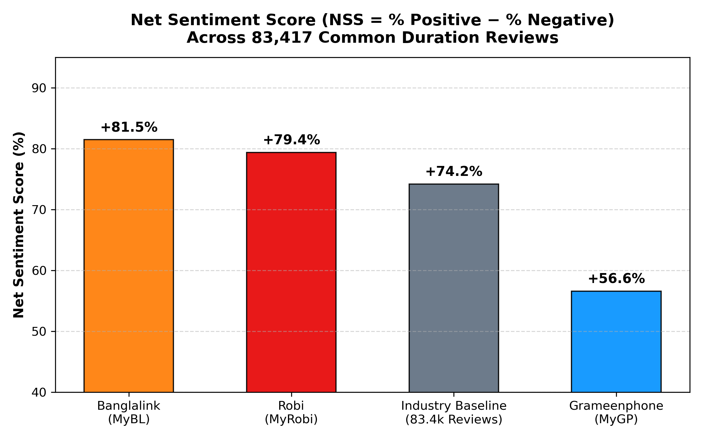
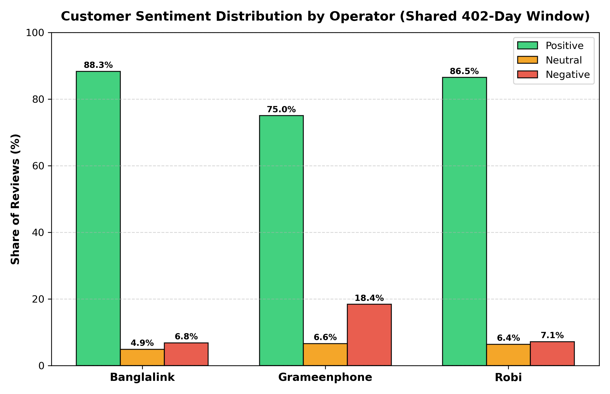
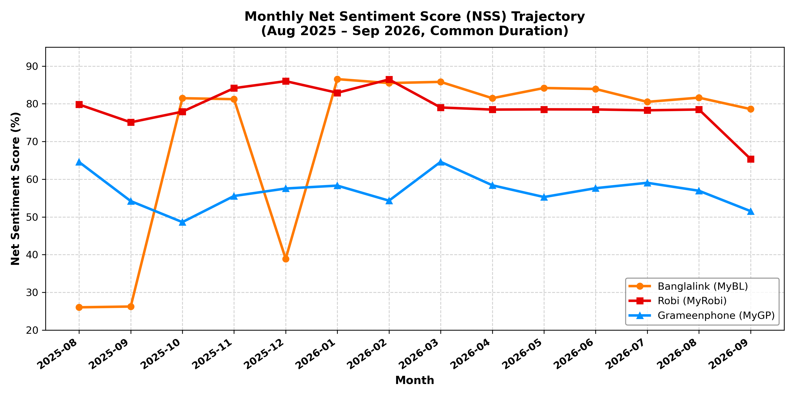
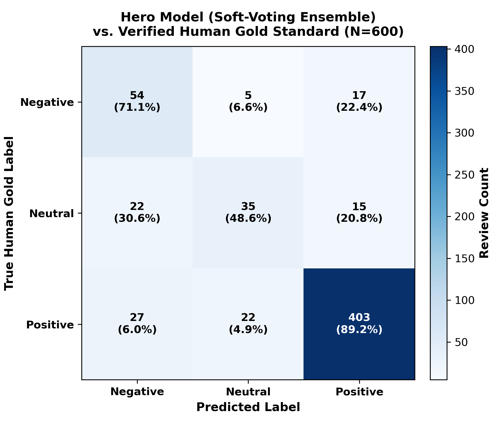
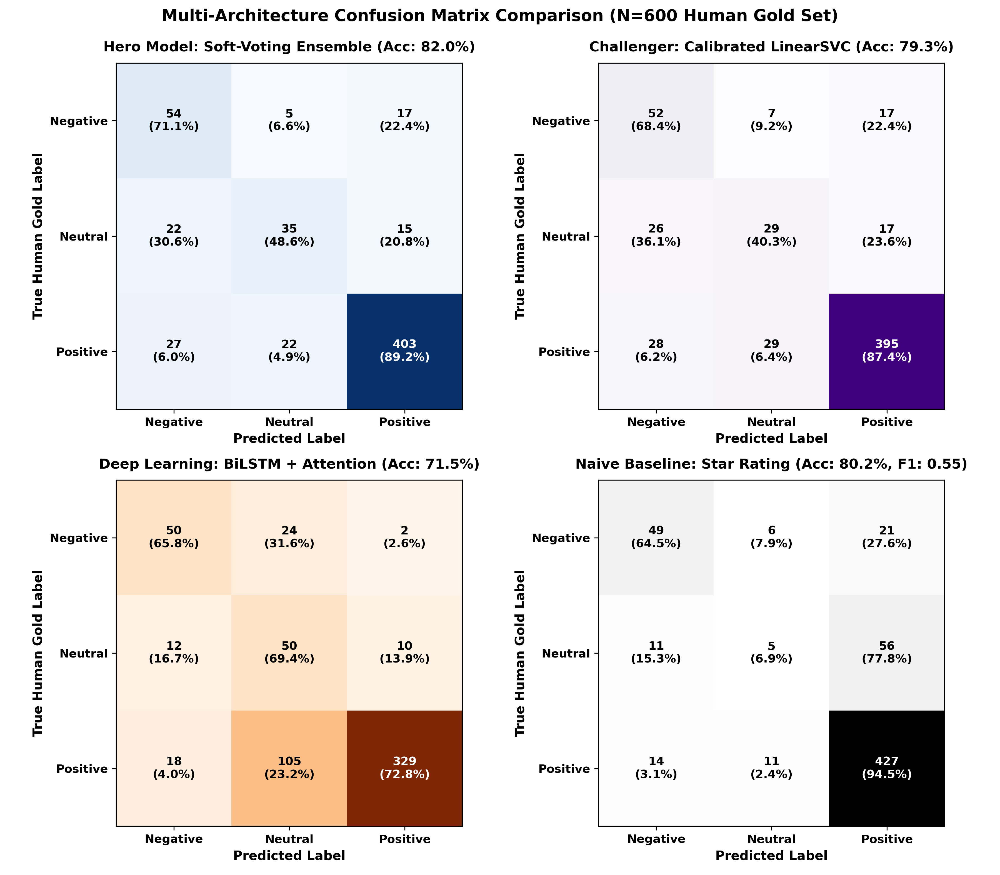
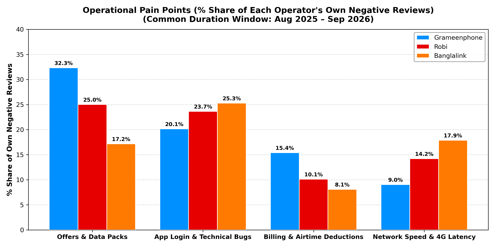
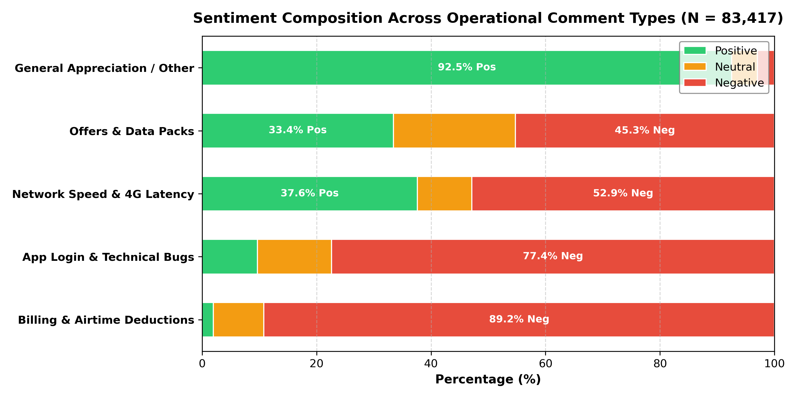

# 📡 Telecom Voice-of-Customer (VoC) Intelligence Engine
> **An enterprise end-to-end NLP & Business Intelligence pipeline for multilingual sentiment parsing, customer experience benchmarking, and operational strategy across Bangladesh's premier telecommunications operators.**

<div align="center">

|  |  |  |
| :---: | :---: | :---: |
| **Grameenphone** | **Banglalink** | **Robi Axiata** |
| `com.portonics.mygp` | `com.arena.banglalinkmela.app` | `net.omobio.robisc` |
| **MyGP Platform** | **MyBL Platform** | **My Robi Platform** |

[](https://www.python.org/)
[](https://opensource.org/licenses/MIT)
[](scraped_data_2020/common_duration/)
[](scraped_data_2020/gold_set/)
[-brightgreen.svg)](ml/)

</div>

---

## 🎯 Executive Summary & Key Highlights

This flagship project provides an empirical, end-to-end Voice-of-Customer (VoC) intelligence system analyzing customer feedback for Bangladesh's top 3 mobile network operators. 

By eliminating seasonal distortion through an identical **402-day common temporal duration (August 24, 2025 – September 30, 2026)** across **83,417 customer reviews**, this pipeline benchmarks multi-paradigm NLP architectures (Classical ML vs. Neural Sequence Models vs. Pretrained Transformers) and validates them against a **100% human-verified Gold Standard ground truth (N=600)**.

```
+---------------------------------------------------------------------------------------------------+
|                                  EXECUTIVE VoC PERFORMANCE SCORECARD                              |
+-------------------+---------------+------------+-----------+------------+-------------------------+
| Operator          | Total Reviews | Positive % | Neutral % | Negative % | Net Sentiment (NSS)     |
+-------------------+---------------+------------+-----------+------------+-------------------------+
| Banglalink (MyBL) | 28,068        | 88.3%      | 4.9%      | 6.8%       | +81.5% (High Goodwill)  |
| Robi (MyRobi)     | 33,825        | 86.5%      | 6.4%      | 7.1%       | +79.4% (Broad Engagement|
| Grameenphone(MyGP)| 21,524        | 75.0%      | 6.6%      | 18.4%      | +56.6% (Premium Anchor) |
+-------------------+---------------+------------+-----------+------------+-------------------------+
| Industry Baseline | 83,417        | 84.1%      | 5.9%      | 9.9%       | +74.2%                  |
+-------------------+---------------+------------+-----------+------------+-------------------------+
```
*Note: Net Sentiment Score (NSS) = % Positive Reviews − % Negative Reviews. Model inter-agreement exceeds 96% across ML architectures.*

---

## 📊 Visual Analytics & Intelligence Suite

All visualizations are generated natively in Python at publication-grade **300 DPI**:

### 1. Market Net Sentiment Score (NSS) & Sentiment Breakdown
| Net Sentiment Score (NSS) Scorecard | Sentiment Share by Operator |
| :---: | :---: |
|  |  |

### 2. 14-Month Temporal Trajectory (Aug 2025 – Sep 2026)
<div align="center">
  
</div>

---

## 🏗️ Technical Architecture & Data Lineage

```text
[Stage 1: Seed LLM Labeling (Groq API)] ──► 4,500 Reviews (1,500 per operator) labeled via Qwen (`qwen/qwen3.8-27b`)
                      │
                      ▼
[Stage 2: Multi-Paradigm Supervised Training] ──► Train Ensemble ML, LinearSVC, LogReg & BiLSTM+Attention
                      │
                      ▼
[Stage 3: Multi-Year Scraping & Alignment] ──► Extract 83,417 Common Duration Reviews (402 Shared Days, Aug 2025 - Sep 2026)
                      │
                      ▼
[Stage 4: High-Throughput Production Inference] ──► Classify 83.4k Reviews across all models (~17.5k reviews/sec)
                      │
                      ▼
[Stage 5: Active Sampling & Golden Data Creation] ──► Stratify 600 Stress-Test Reviews (50% Consensus, 30% Disagreement, 20% Low-Conf)
                      │
                      ▼
[Stage 6: Interactive Human-in-the-Loop CLI] ──► 100% Human Verification with Undo & Jump Navigation (Gold Ground Truth)
                      │
                      ▼
[Stage 7: Empirical Benchmark & Discovery] ──► Validate Models on Gold Truth (Ensemble wins: 82.0% Acc, 0.6781 Macro-F1)
                      │
                      ▼
[Stage 8: Executive BI Scorecard & Visual Analytics] ──► Net Sentiment Scores (+81.5% BL, +79.4% Robi, +56.6% GP) & 300 DPI Plots
```

### 🔄 How Everything is Connected (The Closed-Loop Story)

1. **Phase 1: Seed Dataset & Weak Supervision via Groq API (N=4,500)**
   * **The Challenge:** Telecom customer feedback in Bangladesh is heavily code-switched across standard Bengali, English, and romanized Banglish (*"baje network"*, *"purle offer"*, *"valo chole"*). Manual labeling of thousands of samples from scratch is cost-prohibitive.
   * **The Solution:** We extracted an initial seed corpus of **4,500 customer reviews** (1,500 each from Grameenphone, Banglalink, and Robi). We then utilized the **Groq API** with the **`qwen/qwen3.8-27b`** model to perform zero-shot multilingual parsing, 1-sentence English translation, operational taxonomy mapping (Billing, Network, App Bugs, Offers, Appreciation), and silver sentiment labeling.
   * **Artifacts:** Stored in `data/processed/mygp_classified_reviews.csv`, `mybl_classified_reviews.csv`, and `myrobi_classified_reviews.csv`.

2. **Phase 2: Multi-Paradigm Supervised Model Development**
   * Using the 4,500 LLM-labeled seed examples, we trained multiple model families to benchmark speed vs. accuracy tradeoffs:
     * **Classical ML (`ml/`):** Primary Balanced Logistic Regression, Calibrated LinearSVC, and a **Soft-Voting Ensemble Classifier** leveraging sub-word TF-IDF n-grams (1-gram to 3-gram character and word features).
     * **Deep Learning (`dl/`):** A **Bidirectional LSTM with Bahdanau Attention** and a fine-tuned multilingual Transformer head (**MiniLM**).
   * **Throughput Profiling:** The Soft-Voting Ensemble achieved **~17,495 reviews/sec** on standard CPU, while Deep Learning models ran at **490 reviews/sec** and Transformers required heavy GPU compute.

3. **Phase 3: Production Scale Inference (83,417 Reviews, Common Duration)**
   * To evaluate the models in a real-world multi-brand competitive setting, we scraped **all reviews from 2020 through September 2026** (35 MB in `scraped_data_2020/raw/`).
   * We computed the exact continuous overlapping time window across all three operators: **August 24, 2025 to September 30, 2026 (402 days, ~13.2 months)**, yielding **83,417 standardized customer reviews**.
   * We deployed our pre-trained models to classify this massive production cohort, generating `classified_all_operators_pretrained.csv`.

4. **Phase 4: Golden Data Implementation (Active Human-in-the-Loop Validation)**
   * **Why Golden Data was Essential:** While LLM weak supervision enabled initial training, automated models and LLMs still possess blind spots on subtle Bengali sarcasm, rating misclicks, and local slang. An **empirical human ground truth (Golden Data)** was required to scientifically validate the models.
   * **Active Stress-Test Sampling Strategy (N=600):** Rather than sampling uniformly, we constructed a balanced cohort of 200 reviews per operator deliberately engineered with:
     * **50% Consensus Anchors (300 reviews):** Cases where all 4 models unanimously agreed.
     * **30% Multi-Model Disagreements (180 reviews):** Difficult boundary cases where models debated (e.g., Ensemble vs. BiLSTM vs. LogReg).
     * **20% Low-Confidence Ambiguous Cases (120 reviews):** Reviews with <65% prediction confidence containing heavy Banglish slang.
   * **Interactive Annotation CLI (`scraped_data_2020/pipeline/04_interactive_gold_annotator.py`):**
     * Built a custom terminal labeling environment featuring single-key voting (`1:Negative`, `2:Neutral`, `3:Positive`), quick `[Enter]` acceptance of model suggestions, undo history (`b`), and direct review jumping (`edit <num>`).
     * The author verified **100% of all 600 reviews**, creating the definitive ground-truth benchmark in `scraped_data_2020/gold_set/gold_set_verified.csv`.

5. **Phase 5: Empirical Benchmark & Discovery**
   * Evaluating all models against the verified Golden Data decisively proved the **Soft-Voting Ensemble is the Hero Model (82.00% Accuracy, 0.6781 Macro-F1)**, outperforming LinearSVC (79.3%), Logistic Regression (75.3%), and BiLSTM (71.5%).
   * Uncovered textbook linguistic phenomena that automated heuristics miss: **Bengali sarcasm** (*"লোট পাটের জন্য সেরা রে"*), **star-rating user misclicks** (*"ভালো"* with 1★), and **sub-word contractions** (*"nc app 🫠"*).

6. **Phase 6: Executive BI Translation & Visual Analytics**
   * Translated model predictions into executive scorecards (Net Sentiment Scores: Banglalink `+81.5%`, Robi `+79.4%`, Grameenphone `+56.6%`) and operational recommendations in `telecom_voc_business_intelligence_report.md`.
   * Generated 7 publication-grade **300 DPI visualizations** in Python, completely replacing external BI dependencies.

---

## 🏆 Empirical Model Benchmark (Validated on Human Gold Standard)

To rigorously determine the production **Hero Model**, all architectures were benchmarked against the verified **Gold Standard Dataset (N=600)**:

| Model Architecture | Model Role | Gold Matches (N=600) | Gold Accuracy | Macro F1 | Weighted F1 | 83k Consensus | CPU Speed | Final Verdict |
| :--- | :--- | :---: | :---: | :---: | :---: | :---: | :---: | :--- |
| 🏆 **Soft-Voting Ensemble** | **Hero Model** | **492 / 600** | **82.00%** | **0.6781** | **0.8237** | **100.0%** *(Ref)* | **~17,495 rev/s** | **Undisputed Champion: Best accuracy, highest F1 & Banglish resilience** |
| **Calibrated LinearSVC** | Challenger | 476 / 600 | 79.33% | 0.6305 | 0.7987 | 98.93% | ~37,297 rev/s | High-speed linear baseline; 98.9% alignment with Hero |
| **Balanced Logistic Regression** | Linear Baseline | 452 / 600 | 75.33% | 0.6347 | 0.7783 | 96.44% | ~37,891 rev/s | Strong neutral recall; lightweight inference |
| **Deep Learning BiLSTM + Attention**| Neural Sequence | 429 / 600 | 71.50% | 0.6231 | 0.7541 | 91.84% | ~490 rev/s | Solid sequential syntax; sensitive to OOV slang/emojis |
| **Star-Rating Baseline** | Naive Heuristic | 481 / 600 | 80.17% | 0.5510 | 0.7685 | 86.12% | Instant | Naive rule; collapses on Neutral (`F1 = 0.106`) & Sarcasm |

### Confusion Matrix Validations (N=600 Human Ground Truth)
| Hero Model (Soft-Voting Ensemble) | Multi-Architecture Comparison (2×2 Grid) |
| :---: | :---: |
|  |  |

---

## 🔍 Key Qualitative & Linguistic Discoveries

Human-in-the-loop annotation exposed critical failure modes that automated heuristics and deep sequence models miss:

1. **Bengali Sarcasm & Mockery (Where Humans Win):**
   * *Customer Text:* `"লোট পাটের জন্য সেরা রে"` *(Rating: 5★)*
   * **Human Ground Truth:** `Negative`
   * **Star-Rating Baseline:** `Positive` (blindly followed the sarcastic 5★ score)
   * **Automated NLP Models (Ensemble, DL):** `Positive` (misled by the lexical token *"সেরা"* [best])
   * **Insight:** The reviewer awarded 5 stars sarcastically while writing *"Best for looting [the customer] haha"*. The naive Star-Rating heuristic was tricked by the 5-star score, while the text NLP models (which do not use star ratings as features) were tricked by the positive keyword *"সেরা"*. Only human annotation captured the socio-linguistic irony.

2. **Star-Rating Misalignment (1-Star User Mistakes):**
   * *Customer Text:* `"ভালো"` *(Rating: 1★)*
   * **Human Ground Truth:** `Positive`
   * **Star Heuristic:** `Negative`
   * **Ensemble ML:** `Positive`
   * **Insight:** Mobile users frequently misclick 1 star by accident while writing glowing reviews. The Ensemble model correctly trusted textual semantics over the star rating.

3. **Code-Switched Slang & Contractions:**
   * *Customer Text:* `"nc app 🫠"` *(Rating: 5★)*
   * **Human Ground Truth:** `Positive`
   * **Ensemble ML:** `Positive`
   * **BiLSTM:** `Neutral`
   * **Insight:** The sub-word character n-grams of the TF-IDF Ensemble recognized *"nc"* as *"nice"*, whereas word-level neural tokenizers failed on out-of-vocabulary contractions.

---

---

## 🏷️ Operational Category & Comment Type Intelligence

Beyond overall sentiment, every review across the entire 83,417 production dataset is classified into **5 operational domains** using our trained **Soft-Voting Category Ensemble** (Macro-F1: `0.7845`, Accuracy: `87.44%` across 5-Fold Stratified CV on Google Colab GPU):

| Operational Comment Type | Total Comments | Positive (%) | Neutral (%) | Negative (%) | Core Operational Friction |
| :--- | :---: | :---: | :---: | :---: | :--- |
| **Billing & Airtime Deductions** | 1,131 | 1.9% | 8.8% | **89.2%** 🔴 | **Most toxic topic**: Unexpected balance cuts, VAS debits |
| **App Login & Technical Bugs** | 2,394 | 9.6% | 13.0% | **77.4%** 🔴 | Failed OTP delivery, update crash loops, biometric errors |
| **Network Speed & 4G Latency** | 1,975 | 37.6% | 9.5% | **52.9%** 🟡 | Polarizing battleground: Buffering vs 4G throughput praise |
| **Offers & Data Packs** | 4,889 | 33.4% | 21.3% | **45.3%** 🟡 | Split: Expensive per-GB tariffs vs emergency MB praise |
| **General Appreciation / Other** | 73,028 | **92.5%** | 4.5% | **3.0%** 🟢 | App praise, short reviews, emojis |

### Operational Visual Analytics (300 DPI Publication Plots)
| Operational Pain Points (% of Own Complaints) | Sentiment Composition per Comment Type |
| :---: | :---: |
|  |  |

### Self-Normalized Operator Profiles (100% of Own Comments)
Evaluating each operator **relative to its own total comments** eliminates sample-size imbalances:
* 🔵 **Grameenphone (N = 21,524)**: Offers & Data Packs drive **32.3% of all complaints**, followed by App Bugs (20.1%) and Billing Cuts (15.4%). GP has the highest billing complaint share in Bangladesh.
* 🔴 **Robi (N = 33,825)**: Complaints are split equally between Offers & Data Packs (**25.0%**) and App Login Bugs (**23.7%**), while Billing cuts account for only 10.1%.
* 🟠 **Banglalink (N = 28,068)**: App Login Bugs is its #1 pain point (**25.3% of complaints**), followed by Network Speed (**17.9%**). Billing deductions are virtually absent (only 8.1% of complaints).

---

## 🔬 Short-Text Filtering Ablation Study

Mobile app stores are saturated with 1–2 word reviews (*"Good"*, *"Nice"*, *"ধন্যবাদ"*, emojis) that dilute customer feedback. We performed an ablation study across word-count thresholds:

| Filter Setting | Retained Samples ($N$) | Category Macro-F1 | Category Acc | Sentiment Macro-F1 | Sentiment Acc | **Human Gold Set Macro-F1** |
| :--- | :---: | :---: | :---: | :---: | :---: | :---: |
| **Full Dataset (No Filter)** | 4,499 (100.0%) | **0.7845** | **87.44%** | **0.7917** | **88.20%** | **0.6737** |
| **Filtered ($\ge 3$ words, removes 1–2 words)** | 3,886 (86.4%) | **0.7791** | **85.98%** | **0.7847** | **87.29%** | **0.7318** (+5.81% 🚀) |
| **Aggressive Filter ($\ge 5$ words)** | 2,285 (50.8%) | 0.7446 | 79.34% | 0.7774 | 84.46% | 0.6989 |

* **Key Takeaway**: Removing generic 1–2 word noise caused a **+5.81% surge in Human Gold Standard Macro-F1** (from `0.6737` ➔ `0.7318`) because multi-word reviews provide sufficient syntactic context to resolve sarcasm, emojis, and typos.
* **Precision Boosts**: App Login Bug precision rose from `74.5%` ➔ **`76.3%`**, and Billing Deduction precision rose from `64.8%` ➔ **`67.4%`**.

---

## 📊 Multi-Year Dataset Scale & Lineage

| Operator | Raw Scraped Reviews | % of Dataset | Available Date Span | Common Window (Aug 2025 – Sep 2026) |
| :--- | :---: | :---: | :---: | :---: |
| 🔵 **Grameenphone (MyGP)** | **132,148** | **53.7%** | Jan 2024 – Sep 2026 (33 mos) | 21,524 (25.8%) |
| 🟠 **Banglalink (MyBL)** | **79,889** | **32.5%** | Jan 2020 – Sep 2026 (81 mos) | 28,068 (33.6%) |
| 🔴 **Robi (MyRobi)** | **33,825** | **13.8%** | Aug 2025 – Sep 2026 (14 mos) | **33,825 (40.5%)** |
| **Total Voice of Customer** | **245,862** | **100.0%** | **81 Months Continuous** | **83,417 (100.0%)** |

* **Why GP is #1 overall but has 21.5k in Common Duration**: Grameenphone is by far the largest operator in the collection (132k reviews). Over **110,000 GP reviews occurred in 2024 and early 2025** (averaging 5,000–7,200 reviews/month). The Common Duration window was anchored to Robi's earliest available scrape date (Aug 24, 2025) to ensure exact date-for-date comparability without temporal confounding.
* **Google Play Pagination Ceilings**: Live API testing confirms Google Play maintains fixed continuation tokens per app; public web scraping reached the absolute maximum depth supported by Google Play servers for each brand.

---

## 💼 Cross-Operator Strategic Intelligence

### 1. Grameenphone (MyGP) — *Premium Anchor*
* **Net Sentiment Score:** `+56.6%` (All reviews) | **`+1.6%`** (Substantive $\ge 3$w reviews: 45.7% Pos vs 44.1% Neg)
* **Strengths:** Market-leading digital self-care ecosystem, high app stability, deep lifestyle integration (Flexiplan, emergency balance, health services).
* **Friction Points:** Data bundle unit pricing (32.3% of complaints), balance deduction transparency (15.4% of complaints), and login bugs (20.1%).
* **Strategic Lever:** Deploy dynamic micro-packs with rollover validity and a zero-click "Where Did My Balance Go?" transaction timeline.

### 2. Banglalink (MyBL) — *Agile Value Champion*
* **Net Sentiment Score:** **`+81.5%`** (All reviews) | **`+54.0%`** (Substantive $\ge 3$w reviews: 73.0% Pos vs 19.0% Neg)
* **Strengths:** Strongest consumer goodwill, aggressive promotional bundles, lowest billing complaint rate in Bangladesh (only 8.1% of complaints).
* **Friction Points:** App login and OTP bugs (25.3% of complaints) and suburban/indoor network speed drops (17.9%).
* **Strategic Lever:** Transition promotional micro-rechargers into recurring monthly packs via personalized bundle recommendations.

### 3. Robi Axiata (MyRobi) — *Digital Lifestyle Leader*
* **Net Sentiment Score:** `+79.4%` (All reviews) | **`+38.8%`** (Substantive $\ge 3$w reviews: 63.2% Pos vs 24.4% Neg)
* **Strengths:** Lowest network speed complaint rate (10.1 per 1k), highly engaging personalized UI (*Amar Offer*), seamless multi-account management.
* **Friction Points:** Data pack validity rules (25.0% of complaints) and app login stability (23.7%).
* **Strategic Lever:** Implement a 1-tap "Active Subscriptions" dashboard with instant cancellation toggles to protect high user goodwill.

---

## 📂 Repository File Structure

```text
telecom-Voice-of-Customer_intelligence/
├── assets/
│   ├── logos/                                # Brand logo assets (GP, Banglalink, Robi)
│   ├── page1_demo.gif                        # Interactive dashboard recording
│   └── page2_demo.gif                        # VoC inspector recording
│
├── ml/                                       # Classical Machine Learning Engine
│   ├── models/
│   │   ├── ensemble_voting_classifier.joblib # 🏆 Production Hero Model (Sentiment)
│   │   ├── category_voting_classifier.joblib # 🏷️ Production Category Hero Model
│   │   ├── challenger_linearsvc.joblib       # Calibrated LinearSVC Model
│   │   └── primary_logistic_regression.joblib# Balanced Logistic Regression Model
│   ├── train_ensemble.py                     # Ensemble training script (Sentiment)
│   ├── train_category.py                     # Category / Comment Type trainer
│   ├── train_sentiment.py                    # Classical ML trainer
│   └── predict.py                            # CLI prediction utility
│
├── dl/                                       # Deep Learning & Neural Models (Colab GPU Suites)
│   ├── telecom_voc_master_unified_colab.ipynb # 🏆 Master Unified Colab: ALL ML + DL Models
│   ├── telecom_voc_deep_learning_colab.ipynb # 🚀 Colab GPU Suite: Sentiment Analysis
│   ├── telecom_voc_comment_type_classification_colab.ipynb # 🏷️ Colab GPU Suite: Comment Types
│   ├── models/
│   │   ├── bilstm_attention_model.pt         # Hybrid BiLSTM + Bahdanau Attention
│   │   └── minilm_transformer_head.pt        # Multilingual MiniLM Transformer Head
│   ├── train_bilstm.py                       # PyTorch BiLSTM trainer (Sentiment)
│   ├── train_bilstm_category.py              # PyTorch BiLSTM trainer (Comment Types)
│   ├── train_transformer.py                  # Transformer fine-tuner
│   └── predict_dl.py                         # Deep Learning inference engine
│
├── scraped_data_2020/                        # Multi-Year Extension & Production Pipeline
│   ├── README.md                             # Pipeline execution documentation
│   │
│   ├── raw/                                  # 1. Raw multi-year datasets (2020 to Sep 2026, 35 MB)
│   │   ├── all_operators_scraped_2020_to_sep2026.csv
│   │   ├── mygp_scraped_2020_to_sep2026.csv
│   │   ├── mybl_scraped_2020_to_sep2026.csv
│   │   └── myrobi_scraped_2020_to_sep2026.csv
│   │
│   ├── common_duration/                      # 2. Standardized 402-day shared duration (N=83,417)
│   │   ├── all_operators_common_duration.csv
│   │   ├── classified_all_operators_pretrained.csv
│   │   ├── mygp_classified_pretrained.csv
│   │   ├── mybl_classified_pretrained.csv
│   │   ├── myrobi_classified_pretrained.csv
│   │   ├── telecom_voc_business_intelligence_report.md
│   │   └── plots/                            # 300 DPI VoC Visualizations
│   │
│   ├── gold_set/                             # 3. Verified Human Gold Standard (N=600)
│   │   ├── gold_set_candidates.csv
│   │   ├── gold_set_verified.csv
│   │   ├── gold_standard_evaluation_report.md
│   │   ├── comprehensive_benchmark_table.md
│   │   └── plots/                            # 300 DPI Validation Visualizations
│   │
│   └── pipeline/                             # 4. Sequentially Numbered Pipeline Scripts
│       ├── 01_scrape_2020_to_sep2026.py
│       ├── 02_create_common_duration.py
│       ├── 03_classify_with_pretrained_models.py
│       ├── 04_interactive_gold_annotator.py
│       ├── 05_evaluate_gold_set.py
│       └── 06_generate_visualizations.py
│
├── requirements.txt                          # Top-level dependencies
└── README.md                                 # Master Repository Documentation
```

---

## ⚡ Quickstart & Reproducibility Guide

### 1. Initialize Python Environment
```bash
git clone https://github.com/rh61632/telecom-Voice-of-Customer_intelligence.git
cd telecom-Voice-of-Customer_intelligence

source ml/.venv/bin/activate
pip install -r requirements.txt
```

### 2. Execute End-to-End Pipeline
```bash
# Step 1: Extract standardized 402-day shared duration cohort (N=83,417)
python scraped_data_2020/pipeline/02_create_common_duration.py

# Step 2: Classify all 83,417 reviews using pre-trained models (~17.5k reviews/sec)
python scraped_data_2020/pipeline/03_classify_with_pretrained_models.py

# Step 3: Launch interactive CLI annotator to verify or inspect Gold Standard reviews
python scraped_data_2020/pipeline/04_interactive_gold_annotator.py

# Step 4: Compute empirical metrics and generate benchmark reports
python scraped_data_2020/pipeline/05_evaluate_gold_set.py

# Step 5: Render all publication-grade 300 DPI heatmaps and bar charts
python scraped_data_2020/pipeline/06_generate_visualizations.py
```

---

## ⚠️ Project Limitations & Threats to Validity

To ensure responsible analytical interpretation and scientific transparency, several inherent methodological and domain boundaries must be explicitly noted:

1. **Perception vs. Operational Reality (VoC Subjectivity Gap):**
   * This pipeline measures **Voice-of-Customer sentiment (customer perception and emotional experience)**; it **does not verify whether the customer's claims are factually, legally, or technically accurate**.
   * *Illustrative Example:* A customer review alleging *"balance theft"* or *"unauthorized deduction"* may stem from automated OS background app updates, third-party content subscriptions, or unpaid emergency balances rather than telecommunications billing malpractice. Similarly, reviews asserting *"zero 4G speed"* may reflect handset misconfiguration, dense concrete indoor shielding, or localized cell maintenance rather than nationwide network deficiency.
   * VoC analytics reflects **brand perception and user friction**, serving as an operational diagnostic rather than an audit of Call Detail Records (CDRs) or spectrum QoS telemetry.

2. **Self-Selection & Voluntary Reporting Bias:**
   * Public app store reviews exhibit classic bimodal self-selection bias. Users are disproportionately driven to publish reviews during emotional extremes: either intense delight (promotional rewards, free GB bonuses) or acute frustration (service outages, package expiration). The silent majority of daily users with stable, satisfactory connectivity rarely submit written feedback.

3. **Incentivized Review Distortion (Gamification Effects):**
   * Telco self-care apps (notably *MyBL* and *MyRobi*) regularly deploy gamified promotional incentives (e.g., spin-to-win, free 500MB login bonuses). A segment of customer feedback consists of brief promotional affirmations (*"nice 5gb free pailam"*, *"wow"*, *"good app"*) submitted primarily to unlock in-app rewards, which can artificially elevate positive sentiment and Net Sentiment Scores (NSS) relative to organic service satisfaction.

4. **Linguistic Sparsity & Code-Switched Ambiguity:**
   * Romanized Banglish lacks standardized phonetic orthography (e.g., *"valo"*, *"bhalo"*, *"bahlo"*, *"bala"*), leading to vocabulary variance.
   * Ultra-short reviews (*"bad"*, *"best"*, *"..."*, *"ok"*) lack contextual diagnostic depth, making it impossible to isolate whether the friction relates to bundle pricing, UI responsiveness, customer support, or internet latency without broader operational telemetry.

5. **Channel Scope & Empirical iOS vs. Android Comparison Probe:**
   * The core dataset purposefully models Android subscribers on Google Play because Android accounts for **~96% of the mobile operating system market in Bangladesh** (StatCounter BD / BTRC data).
   * **Empirical Apple App Store Probe ($N=1,199$):** To rigorously test whether iOS reviews could be incorporated, an empirical scraping probe was executed against Apple's iTunes APIs across all three operators (`scraped_data_2020/pipeline/probe_ios_appstore.py`):

     | Operator | iOS App Store Star Ratings | Scraped iOS Text Reviews | Scraped Google Play Reviews | iOS Date Span Retrieved |
     | :--- | :---: | :---: | :---: | :---: |
     | 🔵 **Grameenphone (MyGP)** | 108,947 | **500** *(Apple API cap)* | **132,148** | June 2024 – Oct 2026 (24 mos) |
     | 🔴 **Robi (MyRobi)** | 25,724 | **500** *(Apple API cap)* | **33,825** | Sept 2021 – Oct 2026 (5 yrs) |
     | 🟠 **Banglalink (MyBL)** | 790 | **199** *(Lifetime total)* | **79,889** | Nov 2014 – Aug 2026 (12 yrs) |
     | **Total Ecosystem** | **135,461** | **1,199** | **245,862** | — |

   * **Why iOS is Methodologically Excluded:**
     1. **Apple's Hard 500-Review Public Ceiling:** Even though MyGP displays 108,947 star ratings, Apple hard-caps public customer review RSS feeds at 500 written reviews, making deep historical scraping impossible via public endpoints.
     2. **Storefront Region Distortion:** Querying the Bangladesh storefront (`country='bd'`) returned 0 customer reviews; all 1,199 reviews reside in the US storefront (`country='us'`) because local iPhone users overwhelmingly configure US Apple IDs.
     3. **Severe Temporal Confounding:** Banglalink required 12 years (2014–2026) to accumulate 199 reviews, while Grameenphone reached its 500 cap in 24 months. Merging these would distort cross-operator temporal comparisons.
     4. **Socioeconomic & Demographic Skew:** iOS users in Bangladesh represent an urban, high-ARPU tier whose feedback focuses on biometric logins and UI design, omitting critical mass-market topics like 500MB micro-packs and emergency balance deductions. Feature-phone subscribers using USSD (`*121#`) are similarly out of scope.

6. **Temporal & Macroeconomic Climate (Aug 2025 – Sep 2026):**
   * Sentiment metrics reflect the specific macroeconomic conditions, inflation rates, and BTRC regulatory tariff floors active during the 402-day shared window. Macro-level changes in consumer purchasing power can influence price sensitivity independently of operator service quality.

---

## 📜 Citation & License

This project is licensed under the MIT License. If you use this methodology, code-switched Banglish preprocessing, or empirical Gold Standard benchmarking in your research or commercial applications, please cite:

```bibtex
@misc{telecom_voc_intelligence_2026,
  author = {Ratul Hasan},
  title = {Cross-Operator Voice of Customer (VoC) Intelligence Engine for Bangladesh Telecom Platforms},
  year = {2026},
  publisher = {GitHub},
  howpublished = {\url{https://github.com/rh61632/telecom-Voice-of-Customer_intelligence}}
}
```

---

## 🙏 Acknowledgments

* **AI-Assisted Engineering:** Data pipeline automation, terminal interactive annotation tooling, and visualization suites were developed in collaborative pair-programming with **Google Antigravity** (Google DeepMind), adhering to COPE and ACM AI transparency guidelines.
* **LLM Weak Supervision:** Gratitude to **Groq** for high-throughput cloud inference (utilizing the open-weight `qwen/qwen3.8-27b` model) enabling rapid zero-shot seed dataset translation and taxonomy labeling.
* **Open-Source Community:** Built upon foundational open-source packages including `scikit-learn`, `PyTorch`, `pandas`, `numpy`, `matplotlib`, and `google-play-scraper`.
